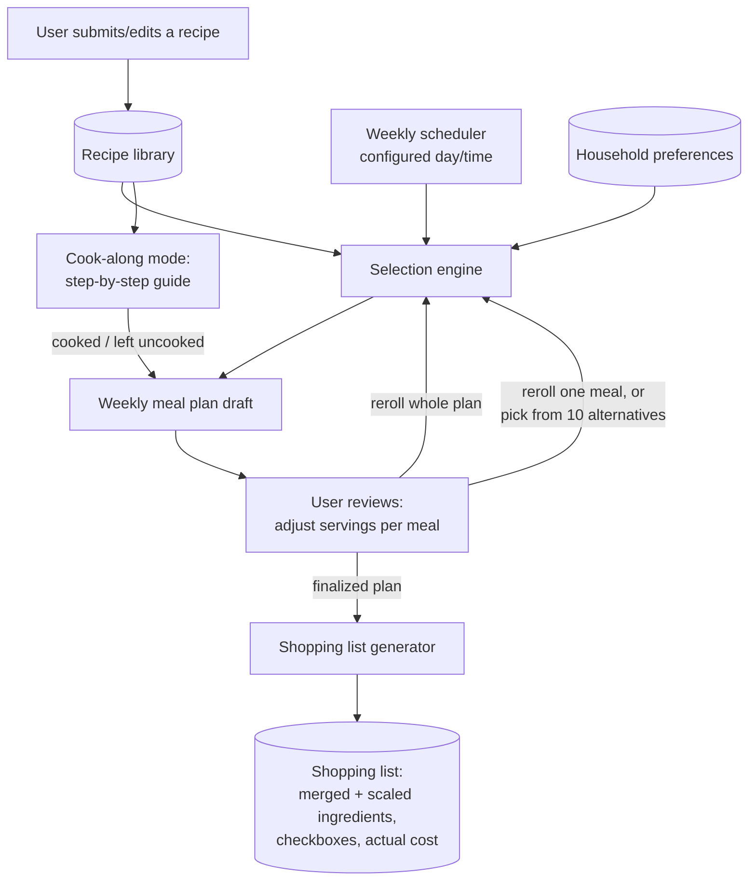

# Design

This document covers product purpose and concepts. For the visual design
system (palette, typography, per-screen layout) see
[`ui_design.md`](ui_design.md); for the implementation roadmap see
[`milestones.md`](milestones.md).

## Purpose

`little-meals` is a meal-planning facilitator and recipe book. It removes the
weekly friction of deciding what to cook, collecting the right ingredients, and
following a recipe while cooking. The user builds up a personal library of
recipes, and the software turns that library into a weekly meal plan, a
single consolidated shopping list, and a guided cook-along mode.

Automatic online recipe collection/suggestion (Milestone 4, backed by
Spoonacular) was tried and removed - see `milestones.md`'s M10 entry. Meal
planning now draws exclusively from recipes already in the household's
cookbook; there is no automatic suggestion of recipes the household hasn't
already saved.

## Goals

- Let the user save recipes they like by entering them directly - name, cook
  time, classification, nutrition, ingredient list, and steps - through the
  recipe edit form.
- Produce a weekly meal plan sized to the user's configured recipe count, drawn
  from the recipes already in the library.
- Let the user ask for different recipes when the current ones don't land: reroll
  the whole draft plan, reroll a single meal for one new alternative, or run a
  controlled reroll that returns 10 alternatives for a single meal to pick from -
  all drawn from the existing library.
- Turn a week's chosen recipes into one shopping list, correctly scaled for
  however many people are eating each meal, with checkboxes for shopping and a
  place to record what the trip actually cost.
- Walk the user through cooking a recipe step by step.
- Be usable entirely through a web application; no other client is planned.
- Serve one household shared by multiple people and devices (see
  [remote access](architecture.md#remote-access--network-security)), all reading
  and writing the same recipe library, preferences, and meal plan.

## Non-goals

- Per-person accounts or separate preferences within the household — there is one
  shared recipe library, one set of preferences, and one meal plan, even though
  several people/devices in the household use it.
- Pantry/inventory tracking (the shopping list assumes nothing is already on hand).
- Photo/OCR recipe import (recipes are provided as text).
- A native mobile app.
- Budget planning beyond recording the actual cost of a generated shopping list.

## Core concepts

| Concept | Description |
|---|---|
| **Recipe** | A saved dish: id/slug, name, estimated cooking time (`cook_time_minutes`), classification (vegetarian, pescetarian, vegan, ketogenic, paleo, other - Milestone 15 added the vegan/ketogenic/paleo options), difficulty (easy, medium, hard, undefined - Milestone 15; user-selectable only among easy/medium/hard, defaulting to undefined when left unset), nutrition (`calories_per_serving`, `protein_g`, `fiber_g` - all optional, since not every recipe entry has this estimated), servings, ingredient list (name, quantity, unit), and an ordered list of cooking steps. Every recipe in the library got there by direct user submission. Stored as a plain Markdown file the user can open and edit directly, not locked inside a database (see [recipe storage format](architecture.md#recipe-storage-format)). |
| **Household preferences** | Configuration shared by the whole household (not per person): recipes-per-week count, default servings per meal (e.g. "2 adults", "2 adults + 1 child"), and two independently-toggleable schedule automations - recommendation day/time (when to close out the current plan and start a new draft) and auto-confirm day/time (when to automatically finalize whatever plan is still a draft, so the household never has to click "Confirm Plan" themselves). |
| **Reroll** | A request for different recipes than the ones currently on the table, at three granularities: reroll the *whole draft plan* (every slot gets a fresh plan, drawn the same way the original was), reroll a *single meal* (swaps in an unused library recipe for that slot), or a *controlled reroll* of a single meal (up to 10 unused library recipes to pick from directly). All three draw only from the existing library — a slot simply can't be filled if the library has nothing unused left to offer. Rerolling is only available on a plan that isn't finalized yet. |
| **Meal plan** | The set of recipes selected for a given week from the existing library, each with a servings count the user can override from the default. The household can also add or remove individual meal slots directly on a draft plan (an "odd week" adjustment) without changing the household's `recipes_per_week` default. Meals aren't assigned to specific days — the household picks from the week's set and cooks them in whatever order suits them. Each meal carries a cooked/not-cooked state, but the "mark cooked" control only appears once the plan is confirmed (finalized) - a draft has nothing to mark cooked yet. The household can mark a meal cooked directly from the plan (a stamp), or it's set automatically when a cook-along session for that meal finishes. Once every meal in a finalized plan is cooked, the plan's "Cancel Plan" action is replaced by "Plan Ahead", which starts a fresh draft for the next round. |
| **Shopping list** | The ingredient list for an entire meal plan: same ingredients across recipes are merged, quantities scaled to each recipe's servings, presented with checkboxes, in one flat list (no grocery-aisle categorization). The user records the actual amount spent once shopping is done. |
| **Cook-along session** | A guided, step-by-step walkthrough of a single recipe's cooking steps, used while actually cooking - reachable for any recipe, whether or not it's in this week's plan; ends with a cooked/left-uncooked choice, which marks the meal cooked in the current plan if that recipe happens to be in it (the same flag the plan review pot-stamp toggle controls). |

## Data flow

1. The user adds or edits a recipe directly (name, nutrition, ingredients,
   cooking steps), and the result is saved to the recipe library.
2. At the user-configured day/time each week, the selection engine builds a draft
   meal plan by drawing from the stored recipe library, up to the configured
   recipes-per-week count. A library smaller than that yields a shorter plan
   rather than inventing anything.
3. The user reviews the draft, adjusting servings per recipe away from the
   configured default if needed. If nothing on offer fits, the user can reroll
   the whole plan (step 2 reruns for every non-finalized slot), reroll a single
   meal (swaps in a different unused library recipe), or run a controlled
   reroll of a single meal to get 10 alternatives to choose from instead of one.
4. Once finalized, the shopping list generator merges ingredients across every
   recipe in the plan, scaling each recipe's ingredient quantities to its servings
   count, and produces one checklist. The user checks items off while shopping and
   records what the trip cost.
5. When the user is ready to cook a recipe from the plan (or any recipe in the
   library) — in whatever order they like, since meals aren't scheduled to
   specific days — cook-along mode presents its steps one at a time, and
   afterwards asks whether it was actually cooked, marking the meal cooked in
   the plan if so. The household can also mark a meal cooked directly from the
   plan review screen without going through cook-along.
