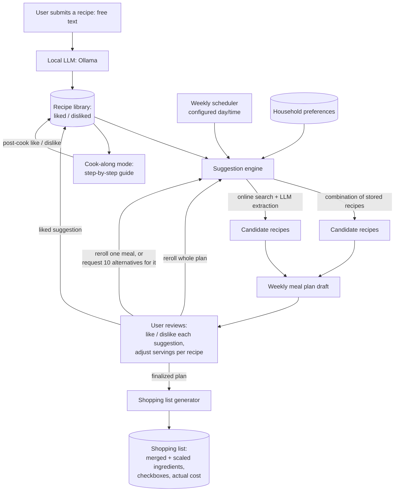

# Design

## Purpose

`little-meals` is a meal-planning facilitator and recipe book. It removes the
weekly friction of deciding what to cook, collecting the right ingredients, and
following a recipe while cooking. The user builds up a personal library of recipes
they've liked, and the software turns that library (plus AI-suggested new recipes)
into a weekly meal plan, a single consolidated shopping list, and a guided
cook-along mode.

## Goals

- Let the user save recipes they like, with the tedious parts (cook time,
  classification, nutrition/calorie estimate, ingredient list, steps) extracted
  automatically by a local LLM rather than typed by hand.
- Produce a weekly meal plan sized to the user's configured recipe count, mixing
  recipes already in the library with new AI-suggested ones.
- Let the household like/dislike suggested recipes — either at the moment they're
  suggested, or later, after actually cooking and trying them — growing (and
  pruning) the recipe library from real feedback.
- Let the user ask for fresh suggestions when the current ones don't land: reroll
  the whole draft plan, reroll a single meal for one new alternative, or run a
  controlled reroll that returns 10 alternatives for a single meal to pick from.
- Turn a week's chosen recipes into one shopping list, correctly scaled for
  however many people are eating each meal, with checkboxes for shopping and a
  place to record what the trip actually cost.
- Walk the user through cooking a recipe step by step.
- Be usable entirely through a web application; no other client is planned.
- Serve one household shared by multiple people and devices (see
  [remote access](architecture.md#remote-access--network-security)), all reading
  and writing the same recipe library, preferences, and meal plan.

## Non-goals

- Per-person accounts or separate preferences within the household — there is one
  shared recipe library, one set of preferences, and one meal plan, even though
  several people/devices in the household use it.
- Pantry/inventory tracking (the shopping list assumes nothing is already on hand).
- Photo/OCR recipe import (recipes are provided as text).
- A native mobile app.
- Budget planning beyond recording the actual cost of a generated shopping list.

## Core concepts

| Concept | Description |
|---|---|
| **Recipe** | A saved dish: name, estimated cooking time, classification (vegetarian, pescetarian, other), estimated nutrition (at minimum calories per serving), ingredient list (with quantities), and ordered cooking steps. Every recipe in the library got there either by direct user submission or by being liked from a suggestion, and carries a preference state — liked by default, or disliked once the household decides, at suggestion time or after actually cooking it, that they don't want it suggested again. Stored as a plain Markdown file the user can open and edit directly, not locked inside a database (see [recipe storage format](architecture.md#recipe-storage-format)). |
| **Household preferences** | Configuration shared by the whole household (not per person): recipes-per-week count, day/time of week to receive recommendations, food preferences (used to steer suggestions), number of new AI suggestions per meal plan, and default servings per meal (e.g. "2 adults", "2 adults + 1 child"). |
| **Suggestion** | A candidate recipe proposed by the system for a meal-plan slot — either a combination of ingredients/steps drawn from stored recipes, or found via an online search seeded by preferences and the existing library. The household can like it (it joins the Recipe library) or dislike it, either while reviewing the draft plan or after actually cooking and trying it. |
| **Reroll** | A request for different suggestions than the ones currently on the table, at three granularities: reroll the *whole draft plan* (every non-finalized slot gets fresh suggestions), reroll a *single meal* (that slot gets one fresh replacement suggestion), or a *controlled reroll* of a single meal (that slot gets 10 alternative suggestions to choose from instead of one). Rerolling never changes recipes already liked/finalized into the plan. |
| **Meal plan** | The set of recipes selected for a given week (a mix of existing recipes and newly liked suggestions), each with a servings count the user can override from the default. |
| **Shopping list** | The ingredient list for an entire meal plan: same ingredients across recipes are merged, quantities scaled to each recipe's servings, presented with checkboxes. The user records the actual amount spent once shopping is done. |
| **Cook-along session** | A guided, step-by-step walkthrough of a single recipe's cooking steps, used while actually cooking; ends with the option to like/dislike the recipe based on how it actually turned out. |

## Data flow

1. The user submits a new recipe as free text. The local LLM (via Ollama) extracts
   estimated cooking time, classification, nutrition/calorie estimate, structured
   ingredients, and cooking steps, and the result is saved to the recipe library.
2. At the user-configured day/time each week, the suggestion engine builds a draft
   meal plan: it fills most of the plan from the stored recipe library — excluding
   disliked recipes — (subject to the configured recipes-per-week count) and
   generates the configured number of new AI suggestions, either by combining
   elements of stored recipes or by searching online using the household's food
   preferences and existing library as context, then extracting the result with
   the same local LLM pipeline used for manual submissions.
3. The user reviews the draft: liking or disliking each suggestion (liked ones join
   the recipe library permanently) and adjusting servings per recipe away from the
   configured default if needed. If nothing on offer fits, the user can reroll the
   whole plan (step 2 reruns for every non-finalized slot), reroll a single meal
   (step 2 reruns for just that slot), or run a controlled reroll of a single meal
   to get 10 alternatives to choose from instead of one.
4. Once finalized, the shopping list generator merges ingredients across every
   recipe in the plan, scaling each recipe's ingredient quantities to its servings
   count, and produces one checklist. The user checks items off while shopping and
   records what the trip cost.
5. When the user is ready to cook a recipe from the plan (or any recipe in the
   library), cook-along mode presents its steps one at a time, and afterwards lets
   the user like or dislike the recipe based on how it actually turned out —
   updating its preference state in the library the same way a suggestion-time
   dislike would.

## Open questions

- Source and mechanism for "automatic online search" (which search backend/API,
  and how search results are turned into structured recipes) is deferred to the
  milestone that implements suggestion generation — see `milestones.md`.
- Exact recipe-combination strategy (how two stored recipes are blended into one
  suggestion) is deferred to the same milestone.
